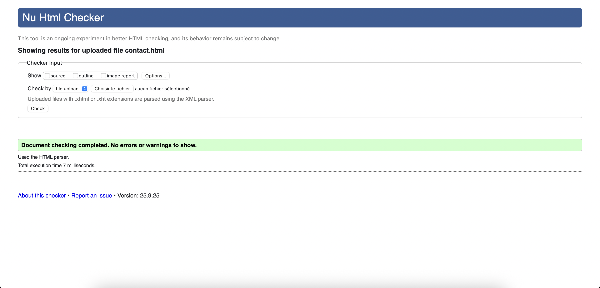
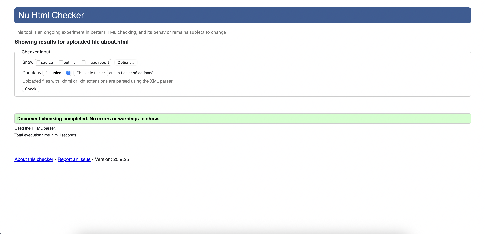

# WebCraft Solutions - Frontend

Un site web frontend pour **WebCraft Solutions**, une entreprise fictive de développement web.

## Technologies utilisées

- HTML
- CSS
- JavaScript Vanilla

## API

Ce projet utilise l'API **WebCraft Projects** :
- Base URL : `https://gabistam.github.io/Demo_API`

## Installation

1. Cloner le repository
2. Ouvrir `index.html` dans votre navigateur

## Structure du projet
```
webcraft-frontend/
├── index.html
├── about.html
├── services.html
├── contact.html
├── assets/
│   ├── css/
│   │   ├── style.css
│   │   └── responsive.css
│   ├── js/
│   │   ├── main.js
│   │   └── api.js
│   └── images/
│       ├── logo.png
│       └── hero-bg.jpg
└── README.md
```

## Validation W3C

Les trois fichiers HTML du projet respectent les normes W3C. Voici les preuves de validation :



